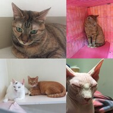
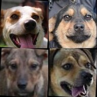
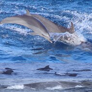

# IndividualAnimalRe-IDDatasets
### a collection of publicly available computer vision datasets for the re-identification of individual animals

|Dataset|# of Individuals|Data|Content|Labels|License|
|--------|--------|--------|--------|--------|--------|
|[AAU Zebrafish Re-Identification Dataset](https://www.kaggle.com/datasets/aalborguniversity/aau-zebrafish-reid) |6 zebrafish|2 videos resulting in 2224 images|side-view of fish in a tank|BB + identity annotations|CC BY 4.0|
|[ATRW](https://www.kaggle.com/datasets/quadeer15sh/amur-tiger-reidentification) |92 tigers|8076 videos|tigers in unconstrained poses|BB + keypoint-based pose + identity annotations|CC BY-NC-SA 4.0|
|[Cat Individual Images](https://www.kaggle.com/datasets/timost1234/cat-individuals) |518 cats|13536 images|front-view of cats with a focus on faces|identity annotations|CC BY 4.0|
|[Cow Dataset](https://doi.org/10.6084/m9.figshare.16879780) |13 cows|3772 Images|side-view of cows|identity annotations|CC BY 4.0|
|[Cows2021](https://github.com/Wormgit/Cows2021) |186 cows|10402 images + 301 videos|top down view of the cows body|oriented BB + identity + tracklet annotations|CC BY-NC-SA 4.0|
|[Dog Face Recognition](https://www.kaggle.com/datasets/wutheringwang/dog-face-recognition) |1174 dogs|?? images|dog faces|identity annotations|CC0: Public Domain|
|[Happy Whale](https://www.kaggle.com/code/chasset/sampling-happywhale/notebook) |15587 whales and dolphins|51033 images|30 species of whales and dolphins entierely or partly above the water surface|identity annotations|Apache 2.0|
|[SealID](https://doi.org/10.23729/0f4a3296-3b10-40c8-9ad3-0cf00a5a4a53) |57 seals|2080 images|seals in unconstrained poses on land|identity annotations|CC BY 4.0|

Species360 has a [Data Sharing Portal](https://conservation.species360.org/data-sharing/) where they provide open-source data on request. Some of the data might suit the task of re-identification

### corresponding publications
|Year|Publication*|Species|Identifying Feature|Corresponding Dataset|
|--------|--------|--------|--------|--------|
|2022|[SealID: Saimaa Ringed Seal Re-Identification Dataset](https://doi.org/10.3390/s22197602)|Saimaa Ringed Seal|pelage patterns|[SealID](https://doi.org/10.23729/0f4a3296-3b10-40c8-9ad3-0cf00a5a4a53)|
|2021|[Individual dairy cow identification based on lightweight convolutional neural network](https://doi.org/10.1371/journal.pone.0260510)|Cows|unspecific|[Cow Dataset](https://doi.org/10.6084/m9.figshare.16879780)|
|2021|[Towards Self-Supervision for Video Identification of Individual Holstein-Friesian Cattle: The Cows2021 Dataset](https://www.researchgate.net/publication/351354662_Towards_Self-Supervision_for_Video_Identification_of_Individual_Holstein-Friesian_Cattle_The_Cows2021_Dataset)|Holstein-Friesian Cattle|coat pattern|[Cows2021](https://github.com/Wormgit/Cows2021)|
|2020|[ATRW: A Benchmark for Amur Tiger Re-identification in the Wild](https://doi.org/10.1145/3394171.3413569)|Amur Tiger|coat pattern|[ATRW](https://www.kaggle.com/datasets/quadeer15sh/amur-tiger-reidentification)|
|2020|[Re-Identification of Zebrafish using Metric Learning](https://doi.org/10.1109/WACVW50321.2020.9096922)|Zebrafish|stripes, body pattern|[AAU Zebrafish Re-Identification Dataset](https://www.kaggle.com/datasets/aalborguniversity/aau-zebrafish-reid)|

*be sure to check for an [ArXiv](https://arxiv.org/) version of any paper that is behind a paywall

### further publications on the topic where the dataset could not be found and might not be public

|Year|Publication|Species|Identifying Feature|
|--------|--------|--------|--------|
|2022|[Honeybee Re-identification in Video: New Datasets and Impact of Self-supervision](https://jachansantiago.com/assets/pdf/VISAPP.pdf)|Honey Bees|abdomen|
|2021|[YakReID-103: A Benchmark for Yak Re-Identification](https://doi.org/10.1109/IJCB52358.2021.9484341)|Yak|fur, texture, horns|
|2021|[Robust Re-identification of Manta Rays from Natural Markings by Learning Pose Invariant Embeddings](https://doi.org/10.1109/DICTA52665.2021.9647359)|Manta Rays|belly markings|
|2021|[Dog Nose-Print Identification Using Deep Neural Networks](https://doi.org/10.1109/ACCESS.2021.3068517)|Dogs|nose|
|2021|[Assessing the performance of open-source, semi-automated pattern recognition software for harbour seal (P. v. vitulina) photo ID]()|Harbour Seal|body pattern|
|2020|[A study on giant panda recognition based on images of a large proportion of captive pandas](https://doi.org/10.1002/ece3.6152)|Giant Panda|face|
|2020|[Automated facial recognition for wildlife that lack unique markings: A deep learning approach for brown bears](https://doi.org/10.1002/ece3.6840)|Brown Bear|face|
|2020|[Image-based Individual Cow Recognition using Body Patterns](https://dx.doi.org/10.14569/IJACSA.2020.0110311)|4 Species of Cow|body pattern|
|2019|[ELPephants: A Fine-Grained Dataset for Elephant Re-Identification](https://doi.org/10.1109/ICCVW.2019.00035)|Elephants|tusks, body shapes, injury marks|
|2019|[Chimpanzee face recognition from videos in the wild using deep learning](https://doi.org/10.1126/sciadv.aaw0736)|Chimpanzee|face|
|2018|[Individual Common Dolphin Identification Via Metric Embedding Learning](https://doi.org/10.1109/IVCNZ.2018.8634778)|Common Dolphin|fin|
|2018|[Individual Minke Whale Recognition Using Deep Learning Convolutional Neural Networks](https://doi.org/10.4236/gep.2018.65003)|Dwarf Minke Whale|fin, scars, body|

### further reading
I'd like to highlight this outstanding publication from 2021 which gives a great overview of the entire topic
[Perspectives on Individual Animal Identification from Biology and Computer Vision](https://doi.org/10.1093/icb/icab107)

